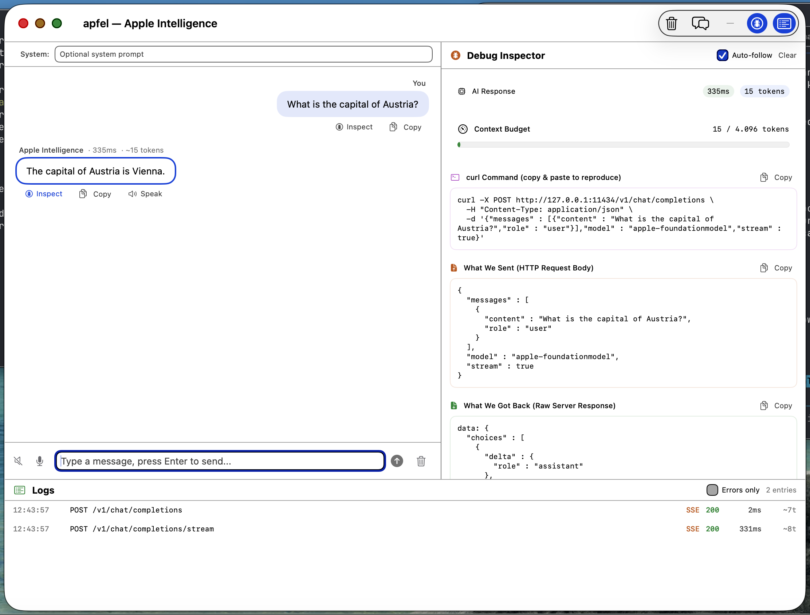

# apfel-gui

Native macOS debug GUI for [apfel](https://github.com/Arthur-Ficial/apfel).

```bash
brew install Arthur-Ficial/tap/apfel-gui
```

```bash
apfel-gui
```

That's it. apfel installs automatically as a dependency.

Requires macOS 26+ (Tahoe) on Apple Silicon with Apple Intelligence enabled.



## What it does

A SwiftUI desktop app that talks to `apfel --serve` via HTTP. Pro debugging tool that shows everything: raw HTTP requests/responses, full MCP JSON-RPC protocol data, server-side event traces, token budgets, SSE streams. Nothing hidden, nothing dumbed down.

On launch, apfel-gui starts `apfel --serve` in the background with MCP tool servers, waits for the health check, and opens the debug window. Quitting the app stops the server.

## Debug Inspector

The debug inspector shows the full timeline of every request, in order:

| Section | What it shows |
|---------|---------------|
| **0. Server Launch Command** | Exact command used to start apfel with all flags |
| **1. Request** | HTTP request body (JSON) sent to the server |
| **2. Server Processing** | Chronological event trace: request decode, context build, MCP tool execution, finish reason |
| **3a. MCP Request** | Full JSON-RPC `tools/call` with method, name, arguments |
| **3b. MCP Response** | Full JSON-RPC result with content text and isError |
| **4. Response** | Timing, token breakdown (prompt + completion), finish reason, context budget, raw SSE |
| **5a. curl Command** | Copy-paste to reproduce via HTTP |
| **5b. apfel CLI** | Equivalent `apfel` command to reproduce from terminal |

## MCP Tool Debugging

MCP servers are auto-discovered and loaded on startup. apfel handles all MCP logic: tool discovery, injection, call detection, execution, and re-prompting. The GUI shows the full raw protocol data.

**Bundled servers:**
- **debug-tools** - `debug_echo`, `timestamp`, `system_info`
- **calculator** (from apfel repo, if found) - `add`, `subtract`, `multiply`, `divide`, `sqrt`, `power`, `round_number`

**Example debug output for a tool call:**
```
MCP Request (JSON-RPC tools/call)
{
  "jsonrpc": "2.0",
  "method": "tools/call",
  "params": {
    "name": "multiply",
    "arguments": { "a": 247, "b": 83 }
  }
}

MCP Response (JSON-RPC result)
{
  "jsonrpc": "2.0",
  "result": {
    "content": [{ "type": "text", "text": "20501" }],
    "isError": false
  }
}
```

Custom MCP servers can be added via the MCP settings in the toolbar.

## Features

- **Chat** with streaming responses
- **Debug inspector** with full request/response timeline
- **MCP debugging** with raw JSON-RPC for every tool call
- **Server event trace** showing context build, chunk deltas, tool execution
- **Live request log** with stats (uptime, req/min, errors, tokens)
- **Model settings** for temperature, max tokens, seed, JSON mode
- **Context strategies** - newest-first, oldest-first, sliding-window, summarize, strict
- **Typed errors** with content policy, context overflow, rate limit handling
- **Speech-to-text** and **text-to-speech** (on-device)
- **Self-discussion** mode for AI self-debate
- **Any OpenAI-compatible server** via advanced connection settings

## Keyboard Shortcuts

| Shortcut | Action |
|----------|--------|
| Cmd+K | Clear chat |
| Cmd+D | Toggle debug panel |
| Cmd+L | Toggle log viewer |
| Cmd+J | Open self-discussion |
| Enter | Send message |

## Build from source

```bash
git clone https://github.com/Arthur-Ficial/apfel-gui.git
cd apfel-gui
make install
```

Requires [apfel](https://github.com/Arthur-Ficial/apfel) installed and in PATH.

## API

Uses the OpenAI-compatible API from `apfel --serve` on port 11438:

| Endpoint | Purpose |
|----------|---------|
| `GET /health` | Server status, version, context window |
| `GET /v1/models` | Model capabilities |
| `POST /v1/chat/completions` | Chat with MCP tool auto-execution |
| `GET /v1/logs` | Request log with events |
| `GET /v1/logs/stats` | Aggregate stats |

## AI Control Mode

Start with `--api` to enable full programmatic control via HTTP on port 11439:

```bash
apfel-gui --api
```

Every GUI action is controllable. No clicking needed.

```bash
# Send a message and get the response
curl localhost:11439/send -d '{"message": "What is 99 times 42?"}'

# Change settings
curl localhost:11439/settings -d '{"temperature": 0.7, "voice_id": "com.apple.voice.premium.en-US.Ava"}'

# Get full debug info for a message
curl localhost:11439/inspect -d '{"index": -1}'

# List all installed voices
curl localhost:11439/voices

# Speak text with a specific voice
curl localhost:11439/speak -d '{"text": "Hello", "voice_id": "com.apple.voice.premium.en-US.Ava"}'
```

**All endpoints:**

| Method | Path | Description |
|--------|------|-------------|
| GET | `/` | Help with all endpoints |
| GET | `/state` | Full app state |
| GET | `/messages` | All messages with metadata, tokens, events, tool calls |
| GET | `/debug` | Debug inspector for selected message |
| GET | `/settings` | Current settings |
| GET | `/voices` | All installed TTS voices with quality levels |
| POST | `/send` | Send message: `{"message": "text"}` |
| POST | `/clear` | Clear chat |
| POST | `/system-prompt` | Set system prompt: `{"prompt": "text"}` |
| POST | `/settings` | Update settings: `{"temperature": 0.7, ...}` |
| POST | `/speak` | Speak text: `{"text": "...", "voice_id": "..."}` |
| POST | `/stop-speaking` | Stop TTS |
| POST | `/toggle-debug` | Toggle debug panel |
| POST | `/toggle-logs` | Toggle log viewer |
| POST | `/inspect` | Inspect message: `{"index": 0}` or `{"id": "..."}` |
| POST | `/self-discuss` | Start self-discussion: `{"topic": "...", "turns": 3}` |

## Related

- [apfel](https://github.com/Arthur-Ficial/apfel) - Apple Intelligence from the command line
